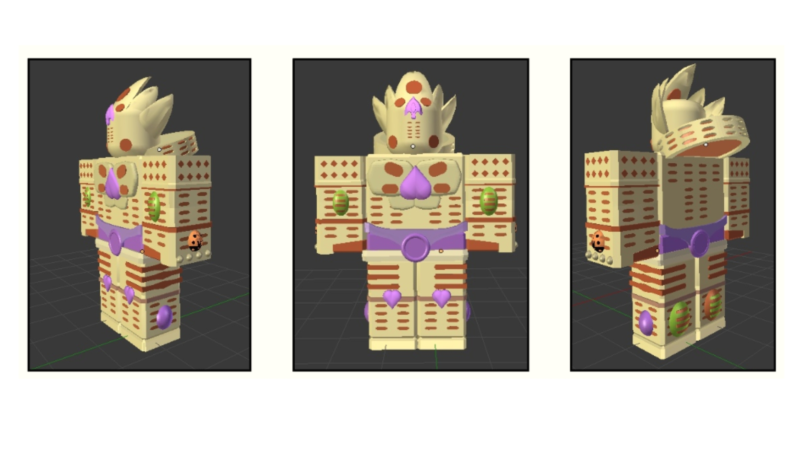
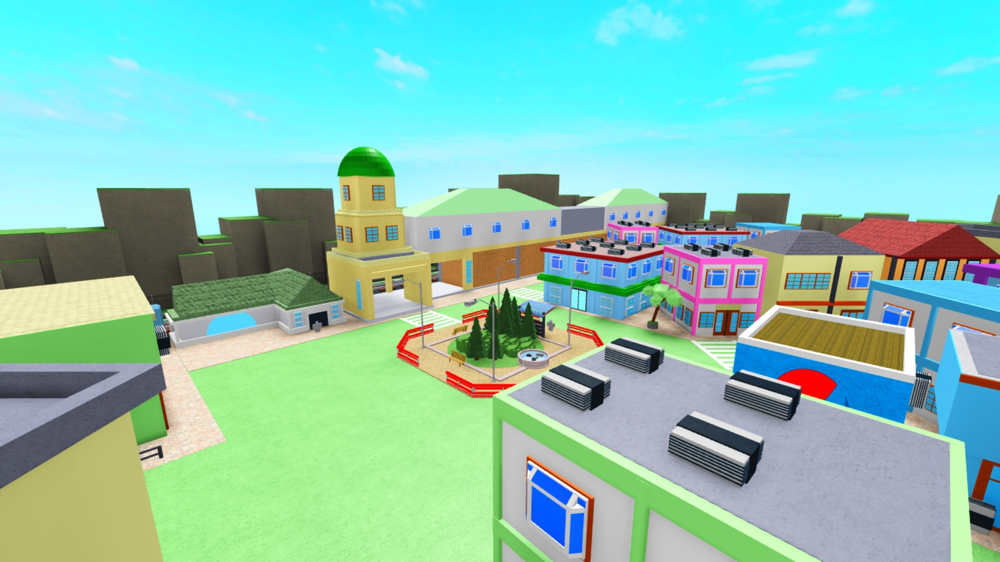
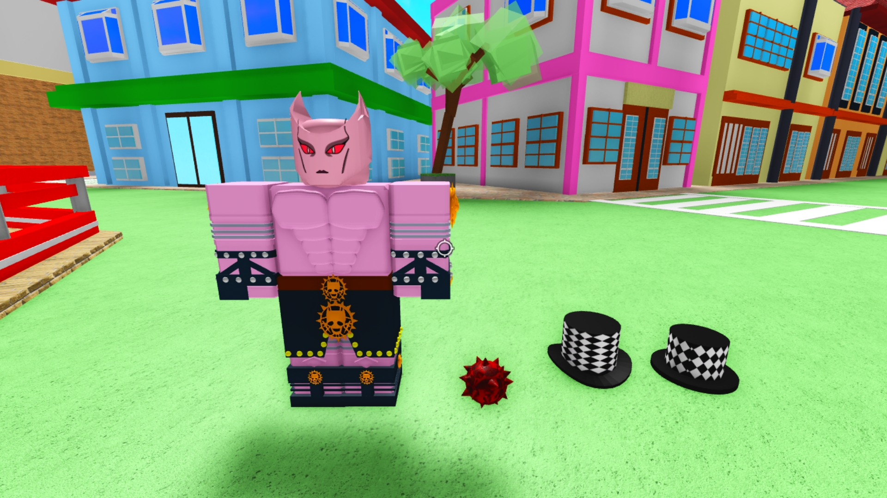
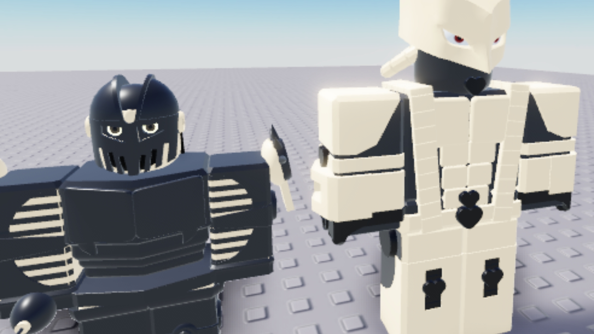
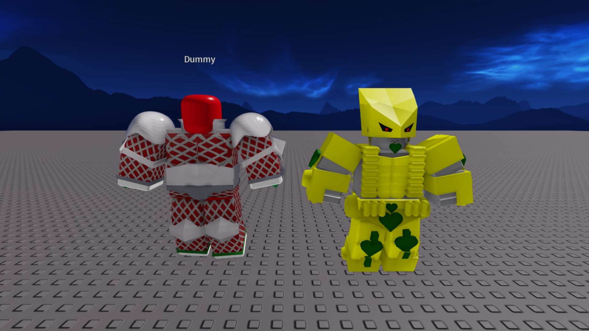

# World of Stands: Combat Environment & Models ⚔️
**Lead Builder & 3D Modeler | Roblox Studio | Blender**

An immersive combat experience inspired by *JoJo's Bizarre Adventure*. This repository showcases the creation of iconic "Stand" character models, custom accessories, and interactive town environments designed for high-intensity dynamic combat.

---

## 📸 Project Gallery
Below are highlights of the character models and environment design.

| Sector | Technical Highlight |
| :--- | :--- |
|  | **Character Modeling:** High-detail recreation of *Gold Experience Requiem* using modular parts. |
|  | **Environment Design:** A vibrant, interactive town map designed for spatial flow and player combat. |
|  | **Asset Creation:** Developed custom character rigs and unique prop assets (Hats, Explosives). |

<b>📂 Click to view full facility tour (Extra shots)</b>

### Character Model Showcase
* 
* 

### Environment & Props
* 
* 

---

## 🛠️ Technical Specifications
* **Engine:** Roblox Studio
* **3D Modeling:** Blender (Custom Meshparts & Character Rigging)
* **Visuals:** Custom texture mapping and cel-shaded aesthetic implementation.
* **Optimization:** Low-poly topology designed for performance in 30+ player servers.

## 📂 Repository Structure
* `source/`: Contains the `.rbxl` project and `.obj` mesh files.
* `documentation/`: High-resolution renders and screenshots of models and maps.
